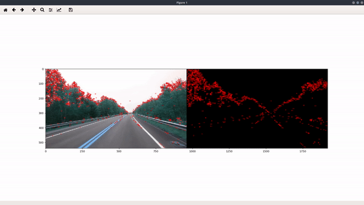

# JSLAM 

  

> Simultaneos localization and mapping with python.
 


---

### Table of Contents 

These are the sections on the [README.md](https://github.com/Johk3/JSLAM/README.md) file. 

- [Description](#description)
- [What can I do with this](#what-can-i-do-with-this)
- [How to Use](#how-to-use)
- [Updates](#updates)
- [References](#references) 
- [Contributing](#contributing) 
- [License](#license)
- [Author Info](#author-info)
- [Contributors](#contributors) 
- [Version Info](#version-info)
- [Help](#help) 
- [Info](#info) 

--- 

## Description 
JSLAM is a python boi that is used to map the environment that the rover will be in. It works by constructing or updating a map of an unknown environment while simultaneously keeping track of an agent's location within it.

If you find a bug on our website be sure to checkout the contact page of the website to tell about the bug or open an issue request here on github. We appreciate every contribution and we try to credit the biggest contributors by placing their name in this readme.

## What can I do with it
In this phase, not much, but after its going out of the beta you couldmap all of your surroundings and potentially have a rover to avoid them
 
#### Technologies 

- Python

## How To Use 

You can run the program like this after installing the libaries
```
python jslam.py
```

#### Prerequistites 

You must have python 3.6 installed and the requirements.txt installed

#### Installation 

Download all packages with
```
pip install -r requirements.txt
```

#### Files are subject to have their name changed and more files can be included without notice. 

---

## Updates 

This is where you can see all the JSLAM version's

0.5.0: 

    Perspective is now able to follow the 3D camera.

    Points are now transferred from 2D to 3D using Pickle.

0.4.0: 

    Started using threads to display 2D and 3D at the same time.

    Created a 3D camera, and got the 2D points of our SLAM.

0.3.0: 

    Switched to SDL2 for displaying video.

    Performance updates.

## References 

[Back To The Top](#JSLAM) 

--- 

## Contributing

If you wish to help on this project you can simply make changes to the file and post your changes and if they are appreciated we will merge them to the Master branch.

--- 

## License 

MIT License

Copyright (c) 2019 J.L

Permission is hereby granted, free of charge, to any person obtaining a copy
of this software and associated documentation files (the "Software"), to deal
in the Software without restriction, including without limitation the rights
to use, copy, modify, merge, publish, distribute, sublicense, and/or sell
copies of the Software, and to permit persons to whom the Software is
furnished to do so, subject to the following conditions:

The above copyright notice and this permission notice shall be included in all
copies or substantial portions of the Software.

THE SOFTWARE IS PROVIDED "AS IS", WITHOUT WARRANTY OF ANY KIND, EXPRESS OR
IMPLIED, INCLUDING BUT NOT LIMITED TO THE WARRANTIES OF MERCHANTABILITY,
FITNESS FOR A PARTICULAR PURPOSE AND NONINFRINGEMENT. IN NO EVENT SHALL THE
AUTHORS OR COPYRIGHT HOLDERS BE LIABLE FOR ANY CLAIM, DAMAGES OR OTHER
LIABILITY, WHETHER IN AN ACTION OF CONTRACT, TORT OR OTHERWISE, ARISING FROM,
OUT OF OR IN CONNECTION WITH THE SOFTWARE OR THE USE OR OTHER DEALINGS IN THE
SOFTWARE.

[Back To The Top](#JSLAM) 

--- 

## Author Info 

- Github - [Thomas](https://github.com/NotLugozzi)
- Github - [Johk3](https://github.com/Johk3)

--- 

## Contributors 

- Thomas 

- Johk3 

--- 

## Version Info 

The current stable version of JSLAM is: 0.5.0  

--- 

## Help 

If there is a bug please contact us through our social media or email. 

- Email Address: johkmr@gmail.com
- [Discord Link](https://discord.gg/EmUedu)

--- 

## Info 

If you have any info you are willing to know contact us on our social media or email. 

Emails are located in [Help](#help) ortherwise use Twitter or Discord.  

--- 

#### Thank you for giving JSLAM a look :) 

---

[Back To The Top](#JSLAM) 
